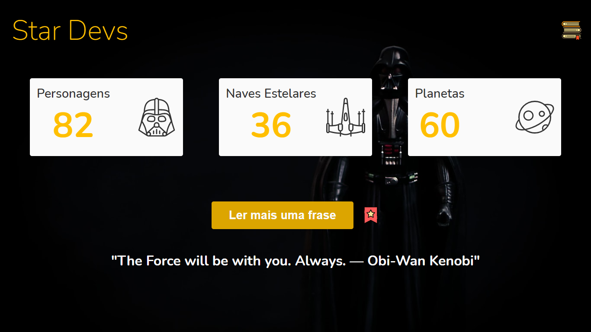

## :memo: About
This project is an application based on the Star Wars saga. The user will have access to information about this universe, in addition to the characters' striking phrases. In addition, the user can add the phrases to favorites and then view them in the side tab, and can also exclude them from favorites.

## :computer: Technologies used
:pushpin: HTML5 

:pushpin: CSS3

:pushpin: Vanilla JavaScript

:pushpin: Fetch API 

:pushpin: SWAPI The Star Wars API 

:pushpin: Star Wars Quote API 

:pushpin: Json Server 

:pushpin: Sweetalert2 lib

## :zap: How to use?
:one: Clone project;  
:two: Open the application in VSCode;  
:three: Run the application with live server;  
:four: Type "json-server --watch db.json" in the terminal;  
:five: Open the route in the browser;

## :heavy_check_mark: Screenshot 1

    

## :heavy_check_mark: Screenshot 2

    

